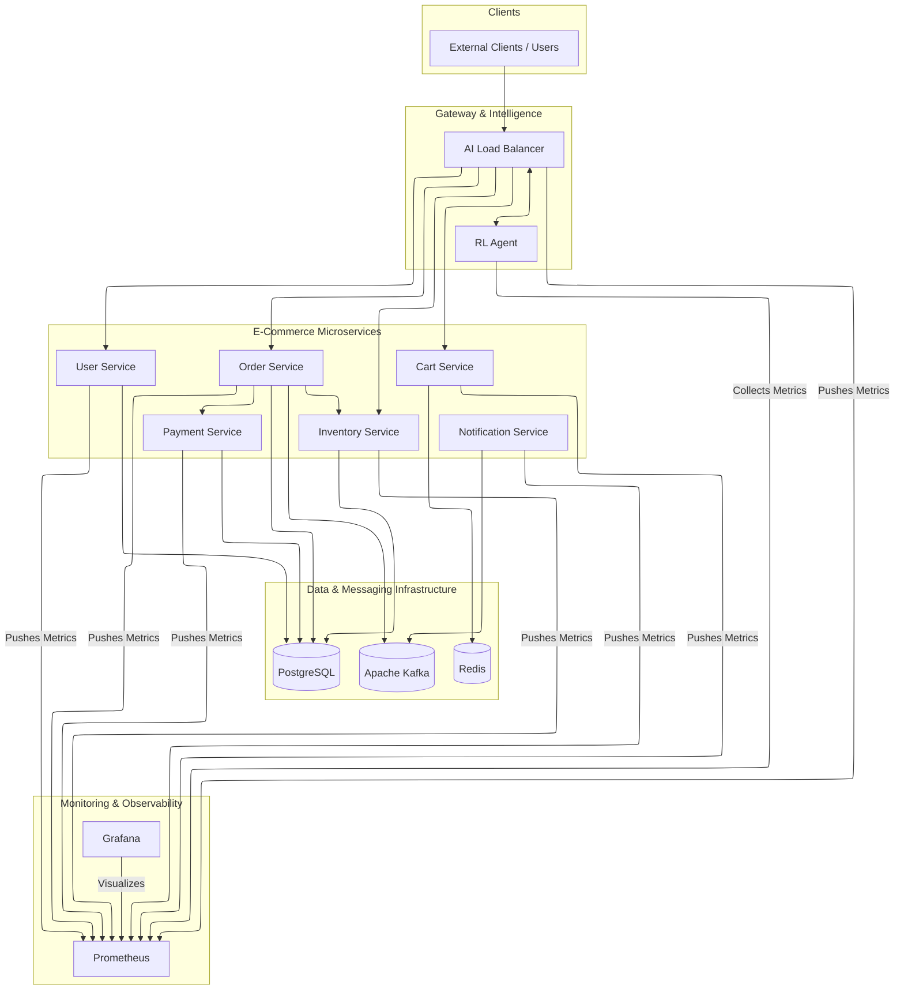

# AI-Powered Load Balancer Microservices Ecosystem

A comprehensive, intelligent load balancing system powered by reinforcement learning (RL) that dynamically optimizes traffic distribution across microservices based on real-time performance metrics.

## 🌟 Project Overview

This project implements an AI-driven load balancer that uses reinforcement learning to make intelligent routing decisions, coupled with a complete e-commerce microservices ecosystem. The system continuously learns from traffic patterns, service performance, and system metrics to optimize load distribution, minimize latency, and improve the overall resilience and efficiency of the application.

### Motivation

Traditional load balancing algorithms, such as Round Robin or Least Connections, are often too simplistic for complex microservice architectures. They do not adapt to the dynamic nature of services, where performance can fluctuate based on load, resource availability, or underlying dependencies. This can lead to suboptimal resource utilization, cascading failures, and a poor user experience.

This project was born out of the need for a more intelligent load balancing solution that can:

*   **Adapt in Real-Time**: Dynamically adjust routing strategies based on the current state of the system.
*   **Optimize for Performance**: Go beyond simple request distribution to actively minimize response times and error rates.
*   **Enhance Resilience**: Proactively route traffic away from struggling or overloaded services to prevent outages.
*   **Maximize Resource Utilization**: Ensure that all service instances are used efficiently, preventing hotspots and underutilization.

By leveraging reinforcement learning, the AI Load Balancer can learn the unique performance characteristics of each service and make data-driven decisions to achieve these goals.

## 🏗️ High-Level Architecture

The architecture is designed around a central AI-powered load balancer that acts as the single entry point for all client requests. It intelligently routes traffic to a suite of backend microservices, each responsible for a specific business domain. The entire system is observable through a dedicated monitoring stack.


## 🛠️ Technology Stack

The ecosystem is built on a modern, robust technology stack, chosen for scalability, performance, and developer productivity.

### Backend & Microservices
*   **Language**: Java 17
*   **Framework**: Spring Boot 3
*   **Build Tool**: Maven
*   **API Style**: RESTful APIs
*   **Security**: Spring Security with JWT for stateless authentication

### AI & Machine Learning
*   **Language**: Python 3.9+
*   **Core Library**: Custom Q-Learning implementation
*   **Data Processing**: Pandas and NumPy for metrics analysis and state representation

### Data Storage & Caching
*   **Relational Database**: PostgreSQL for all transactional and service-related data (Users, Orders, Inventory, etc.).
*   **In-Memory Cache & Registry**: Redis for high-speed caching, session management, and service discovery.

### Monitoring & Observability
*   **Metrics Collection**: Prometheus to scrape and store time-series metrics from all services.
*   **Visualization**: Grafana for creating insightful dashboards to monitor system health and performance.
*   **Instrumentation**: Micrometer integrated with Spring Boot Actuator for application-level metrics.

### Infrastructure & Deployment
*   **Containerization**: Docker to package each microservice into a portable container.
*   **Orchestration**: Kubernetes for deploying, scaling, and managing the containerized application in a production environment.
*   **Local Development**: Docker Compose to easily spin up the entire stack on a local machine.

## 🏢 Microservice Components

This section provides a detailed look at each microservice, its responsibilities, and how it interacts with the rest of the system.

### 1. AI Load Balancer (`load-balancer`)

*   **Purpose**: Acts as the intelligent gateway to the entire microservices ecosystem. It intercepts all incoming client requests and dynamically routes them to the most suitable service instance based on decisions from the RL Agent.

*   **Key Responsibilities**:
    *   **Request Proxying**: Forwards incoming traffic to the appropriate backend service.
    *   **Dynamic Routing**: Implements the routing decisions provided by the RL Agent.
    *   **Service Discovery**: Maintains a real-time registry of available service instances and their health, using Redis.
    *   **Health Checks**: Actively monitors the health of downstream services to avoid routing requests to unhealthy instances.
    *   **Metrics Collection**: Gathers and exposes critical metrics (e.g., request latency, error rates) for itself and the services it routes to, tagged by the active routing algorithm.

*   **Core Interactions**:
    *   **Receives requests from**: External Clients.
    *   **Communicates with**: RL Agent (to get routing decisions), Redis (for service discovery), and all backend microservices (to proxy requests).
    *   **Pushes metrics to**: Prometheus.

### 2. RL Agent (`rl_agent`)

*   **Purpose**: The "brain" of the load balancing system. This Python-based service implements the reinforcement learning model that learns and predicts the optimal routing strategy.

*   **Key Responsibilities**:
    *   **Metrics Analysis**: Consumes real-time performance metrics (CPU, memory, latency, error rates) from Prometheus.
    *   **State Representation**: Converts the raw metrics into a state that the Q-learning model can understand.
    *   **Decision Making**: Uses the trained Q-table to determine the best service instance (action) for a given state.
    *   **Model Training**: Continuously updates its Q-table based on feedback (rewards) from the system's performance after a decision is made.
    *   **Feedback Loop**: Receives feedback from the Load Balancer about the outcome of its routing decisions to calculate rewards.

*   **Core Interactions**:
    *   **Communicates with**: AI Load Balancer (providing decisions and receiving feedback), Prometheus (pulling metrics).

### 3. User Service (`user-service`)

*   **Purpose**: Manages all aspects of user identity, including authentication, authorization, and profile management. It is the gatekeeper for securing the e-commerce platform.

*   **Key Responsibilities**:
    *   **User Registration**: Onboards new users and securely stores their credentials.
    *   **Authentication**: Verifies user credentials and issues JSON Web Tokens (JWTs) upon successful login.
    *   **Authorization**: Enforces role-based access control (RBAC) to protect endpoints.
    *   **Profile Management**: Provides endpoints for users to view and manage their profile information.

*   **Core Interactions**:
    *   **Receives requests from**: AI Load Balancer.
    *   **Communicates with**: PostgreSQL (to persist user data).
    *   **Pushes metrics to**: Prometheus.

*   **API Endpoints**:
    *   `POST /api/users/register`: Creates a new user account.
    *   `POST /api/users/login`: Authenticates a user and returns a JWT.
    *   `GET /api/users/me`: Retrieves the profile of the currently authenticated user.
    *   `GET /api/users/{userId}`: Retrieves the profile of a specific user by their ID (admin-only or self-access).

### 4. Cart Service (`cart-service`)

*   **Purpose**: Manages shopping carts for both registered users and anonymous guests. It handles adding, updating, and removing items from the cart.

*   **Key Responsibilities**:
    *   **Cart Management**: Provides full CRUD (Create, Read, Update, Delete) operations for shopping carts.
    *   **Session Handling**: Manages temporary carts for guest users using session IDs and merges them with user accounts upon login.
    *   **State Persistence**: Stores cart data in a fast, non-relational data store (likely Redis) to ensure quick access and scalability.
    *   **Order Conversion**: Coordinates with the Order Service to convert a cart into a finalized order.

*   **Core Interactions**:
    *   **Receives requests from**: AI Load Balancer.
    *   **Communicates with**: Redis (to store cart data), Order Service (to initiate order creation).
    *   **Pushes metrics to**: Prometheus.

*   **API Endpoints**:
    *   `GET /api/cart`: Retrieves the current user's or session's cart.
    *   `POST /api/cart/items`: Adds a product to the cart.
    *   `PUT /api/cart/items`: Updates the quantity of a product in the cart.
    *   `DELETE /api/cart/items/{productId}`: Removes a specific product from the cart.
    *   `DELETE /api/cart`: Clears all items from the cart.
    *   `POST /api/cart/merge`: Merges a guest cart with a registered user's cart after login.
    *   `POST /api/cart/{userId}/convert-to-order`: Internal endpoint used by the Order Service to clear a cart after an order is successfully created.

### 5. Order Service (`order-service`)

*   **Purpose**: Orchestrates the entire order processing workflow, from creation and payment to fulfillment and tracking.

*   **Key Responsibilities**:
    *   **Order Creation**: Creates a new order from a user's cart, validates inventory, and processes payment.
    *   **Order Management**: Provides endpoints to view order history, check order status, and cancel orders.
    *   **Service Orchestration**: Acts as a central coordinator that communicates with multiple other services (Inventory, Payment, Notification, Cart) to fulfill an order.
    *   **Transactional Integrity**: Ensures that an order is created atomically. If any part of the process fails (e.g., payment), the entire transaction is rolled back.

*   **Core Interactions**:
    *   **Receives requests from**: AI Load Balancer.
    *   **Communicates with**: PostgreSQL (to persist order data), Cart Service (to clear the cart), Inventory Service (to reserve stock), Payment Service (to process payment), Notification Service (to send emails/SMS).
    *   **Pushes metrics to**: Prometheus.

*   **API Endpoints**:
    *   `POST /api/orders`: Creates a new order.
    *   `GET /api/orders/{orderId}`: Retrieves a specific order by its ID.
    *   `GET /api/orders/user`: Retrieves all orders for the currently authenticated user.
    *   `PUT /api/orders/{orderId}/status`: Updates the status of an order (e.g., SHIPPED, DELIVERED).
    *   `POST /api/orders/{orderId}/cancel`: Cancels an existing order.

### 6. Inventory Service (`inventory-service`)

*   **Purpose**: Manages the product catalog and tracks stock levels. It is the source of truth for product availability.

*   **Key Responsibilities**:
    *   **Product Catalog**: Manages product information, including SKU, name, description, and price.
    *   **Stock Management**: Tracks the quantity of each product available for sale.
    *   **Inventory Reservation**: Implements a reservation system to temporarily hold stock for a user during the checkout process, preventing overselling.
    *   **Stock Adjustments**: Provides endpoints for confirming reservations (decrementing stock) or releasing them (returning stock to the available pool).

*   **Core Interactions**:
    *   **Receives requests from**: AI Load Balancer, Order Service.
    *   **Communicates with**: MongoDB (to persist product and stock data).
    *   **Pushes metrics to**: Prometheus.

*   **API Endpoints**:
    *   `GET /api/inventory/products`: Retrieves the list of all products.
    *   `GET /api/inventory/products/{sku}`: Fetches details for a specific product.
    *   `GET /api/inventory/search?query=...`: Searches the product catalog.
    *   `POST /api/inventory/check`: Checks the availability of one or more products.
    *   `POST /api/inventory/reserve`: Reserves stock for an order, returning a reservation ID.
    *   `POST /api/inventory/confirm/{reservationId}`: Confirms a reservation, permanently decrementing the stock.
    *   `POST /api/inventory/release/{reservationId}`: Cancels a reservation, returning stock to the available pool.

### 7. Payment Service (`payment-service`)

*   **Purpose**: Securely processes all financial transactions related to orders.

*   **Key Responsibilities**:
    *   **Payment Processing**: Integrates with external payment gateways to authorize and capture payments.
    *   **Transaction Logging**: Securely logs all payment attempts, successes, and failures for auditing purposes.

*   **Core Interactions**:
    *   **Receives requests from**: Order Service.
    *   **Communicates with**: External Payment Gateway, PostgreSQL (to log transactions).
    *   **Pushes metrics to**: Prometheus.

*   **API Endpoints**:
        *   `POST /api/payments`: Processes a payment for a given order.
        *   `GET /api/payments/{paymentId}`: Retrieves the status and details of a specific payment transaction.
        *   `POST /api/payments/{paymentId}/refund`: Initiates a refund for a previously completed payment.

### 8. Notification Service (`notification-service`)

*   **Purpose**: Manages all outbound communications with users, such as emails, SMS, and push notifications.

*   **Key Responsibilities**:
    *   **Message Delivery**: Sends transactional notifications for events like order confirmation, shipment, and password resets.
    *   **Template Management**: Manages reusable templates for different types of notifications.
    *   **User Preferences**: Allows users to manage their notification preferences.

*   **Core Interactions**:
    *   **Receives requests from**: Order Service, User Service (for password resets, etc.).
    *   **Communicates with**: External email/SMS gateways (e.g., SendGrid, Twilio).
    *   **Pushes metrics to**: Prometheus.

*   **API Endpoints**:
    *   `POST /api/notifications`: (Internal) Creates and sends a notification.
    *   `GET /api/notifications`: Retrieves a user's notification history.
    *   `PUT /api/notifications/{id}/status`: Marks a notification as read or archived.

## 🌊 End-to-End Flow: Placing an Order

To understand how the microservices work together, let's trace a typical user journey: placing an order. This flow demonstrates the orchestration required to complete a transaction.

```mermaid
ssequenceDiagram
    participant Client
    participant AI_Load_Balancer as AI_Load_Balancer
    participant User_Service as User_Service
    participant Order_Service as Order_Service
    participant Inventory_Service as Inventory_Service
    participant Payment_Service as Payment_Service
    participant Cart_Service as Cart_Service
    participant Notification_Service as Notification_Service

    Note over Client, User_Service: 1. Authentication
    Client->>+AI_Load_Balancer: POST /api/users/login
    AI_Load_Balancer->>+User_Service: Forward login request
    User_Service-->>-AI_Load_Balancer: Returns JWT Token
    AI_Load_Balancer-->>-Client: JWT Token

    Note over Client, Order_Service: 2. Place Order with Token
    Client->>+AI_Load_Balancer: POST /api/orders (Auth: JWT)
    AI_Load_Balancer->>+Order_Service: Forward request

    Order_Service->>+Inventory_Service: POST /api/inventory/reserve
    Inventory_Service-->>-Order_Service: Reservation ID

    Order_Service->>+Payment_Service: POST /api/payments
    Payment_Service-->>-Order_Service: Payment Success

    Order_Service->>+Inventory_Service: POST /api/inventory/confirm/{reservationId}
    Inventory_Service-->>-Order_Service: Stock Confirmed

    Order_Service->>+Cart_Service: POST /api/cart/{userId}/convert-to-order (Clear Cart)
    Cart_Service-->>-Order_Service: Cart Cleared

    Order_Service->>Order_Service: Save Order to DB (Status: PAID)

    Order_Service->>+Notification_Service: POST /api/notifications (Send Confirmation)
    Notification_Service-->>-Order_Service: Notification Sent

    Order_Service-->>-AI_Load_Balancer: 201 Created (Order Details)
    AI_Load_Balancer-->>-Client: 201 Created (Order Details)

```

## 🚀 Running the Project

The entire stack can be launched for local development using Docker Compose.

1.  **Prerequisites**: Ensure you have Docker and Docker Compose installed on your system.
2.  **Build & Launch**: Run the following command from the project's root directory to build the images and start all containers:
    ```bash
    docker-compose up --build
    ```
3.  **Accessing Services**:
    *   **Grafana Dashboards**: `http://localhost:3000` (login with `admin`/`admin`)
    *   **Prometheus UI**: `http://localhost:9090`
    *   **AI Load Balancer**: `http://localhost:8080` (all API requests should be routed through this entry point)

For detailed instructions on deploying to a Kubernetes cluster, please refer to the `KUBERNETES_DEPLOYMENT_GUIDE.md`.

## 📊 Monitoring & Observability

The system is equipped with a robust monitoring stack to provide deep insights into its behavior and performance:

*   **Prometheus**: Acts as the central time-series database, scraping and storing metrics from all microservices, the load balancer, and the RL agent.
*   **Grafana**: Offers pre-configured dashboards for visualizing key performance indicators (KPIs), including request rates, latency, error rates, system resource usage, and the RL agent's decision-making patterns.
*   **Micrometer**: Integrated into each Spring Boot application to expose application-level metrics in a Prometheus-compatible format.
*   **Fluent Bit**: Deployed in the Kubernetes environment to aggregate logs, providing a centralized logging solution.

## 🔮 Future Work

This project serves as a strong foundation for a production-grade, intelligent traffic management system. Potential future enhancements include:

*   **Advanced RL Algorithms**: Experiment with more complex reinforcement learning models, such as Actor-Critic (A2C) or Proximal Policy Optimization (PPO), to handle more sophisticated state representations.
*   **Automated Canary Deployments**: Integrate the RL agent with a CI/CD pipeline to automate canary analysis, allowing the agent to make data-driven decisions on whether to promote or roll back new service versions.
*   **Multi-Cloud/Multi-Region Deployments**: Extend the architecture to manage traffic across different cloud providers or geographic regions, optimizing for cost, latency, and availability.
*   **Predictive Autoscaling**: Use the insights from the RL agent to predict traffic surges and proactively scale service replicas before demand increases.

---

This document provides a comprehensive guide to the AI-Adaptable Load Balancer project. For more granular details, please consult the source code and the individual README files within each service directory.


