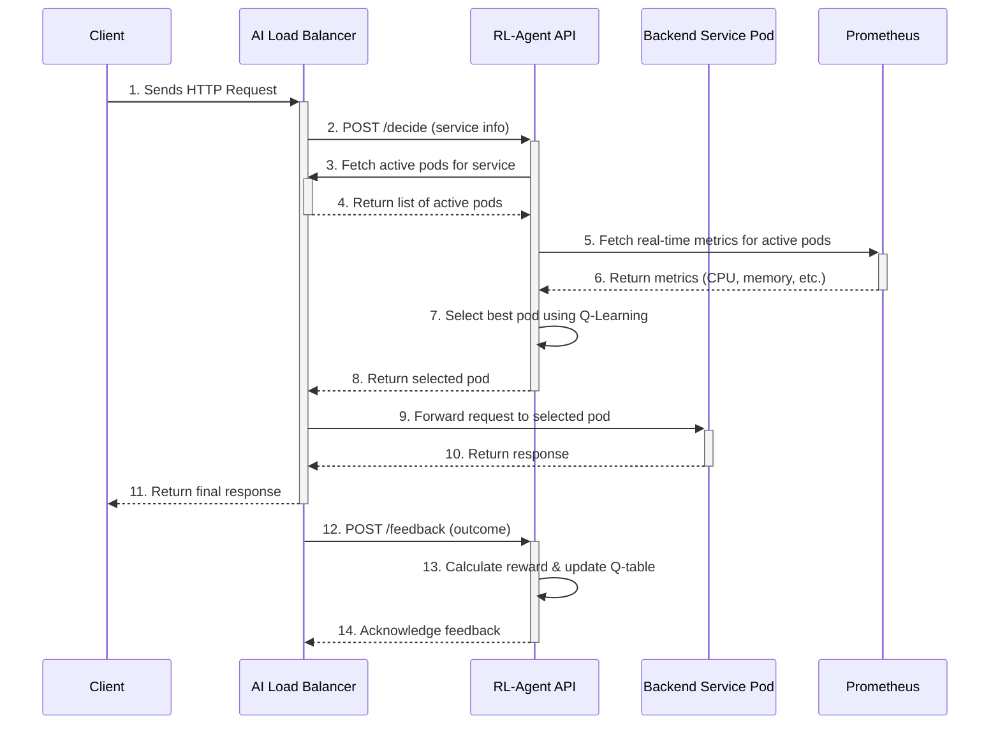
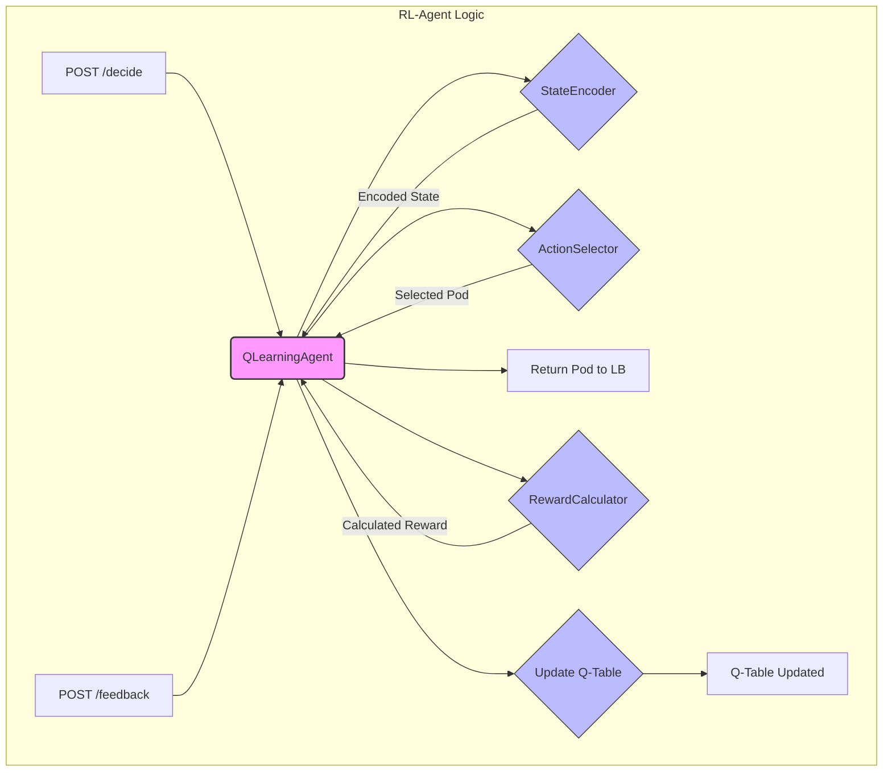

# RL-Agent: Technical Documentation

## 1. Overview

The AI Load Balancer's RL-Agent is a sophisticated decision-making engine that replaces traditional, static load balancing algorithms with an intelligent, adaptive system. It leverages Reinforcement Learning, specifically Q-Learning, to dynamically route traffic based on real-time performance metrics of backend services. 

Unlike algorithms like Round-Robin or Least-Connections that rely on simplistic heuristics, the RL-Agent observes the state of the system (CPU, memory, response time, etc.), takes an action (routes a request to a specific pod), and learns from the outcome (reward or penalty). This continuous learning loop allows it to adapt to changing conditions, such as traffic spikes, pod failures, or gradual performance degradation, ensuring optimal application performance and reliability.

## 2. Motivation and Problem Description

Modern microservices architectures are highly dynamic. Services scale up and down, pods can become unhealthy, and traffic patterns can change in seconds. Traditional load balancing algorithms are ill-equipped to handle this complexity.

### The Blind Spots of Traditional Algorithms

1.  **Round-Robin**: 
    -   **How it works**: Distributes requests to servers in a simple, cyclical order.
    -   **The Challenge**: It's completely unaware of server health or performance. A pod at 99% CPU will receive the same number of requests as a healthy pod at 10% CPU. 
    -   **Real-World Failure**: During a flash sale, traffic is sent to an already struggling pod, causing it to crash and trigger a cascading failure across the service.

2.  **Least-Connections**:
    -   **How it works**: Sends requests to the server with the fewest active connections.
    -   **The Challenge**: It assumes a connection is a proxy for load, but ignores the actual work being done. A pod stuck on a slow database query with only a few connections will be favored over a healthy pod handling many quick requests.
    -   **Real-World Failure**: Users are routed to a pod that is technically "available" but has a high response time, leading to a poor user experience and potential timeouts.

## 3. Solution Description: The Adaptive Learning Approach

The RL-Agent is designed to overcome these limitations by implementing a continuous learning loop that adapts to real-time conditions. Instead of relying on a single, static metric, it builds a holistic understanding of the system's health.

### The Core Learning Cycle

1.  **Observe the System State**: The agent collects a rich set of metrics from each available pod, including CPU and memory usage, average response time, error rates, and request throughput. This creates a multi-dimensional "state" that represents the current condition of the entire service.
    *   **Example**: A state might look like `(cpu_high, memory_low, latency_good)`, which tells a much richer story than just `10 active connections`.

2.  **Select an Action**: Based on the current state, the agent chooses an action—in this case, selecting a pod to route the request to. This decision is not random; it's a balance between:
    *   **Exploitation**: Choosing the pod that has historically performed best in the current state.
    *   **Exploration**: Occasionally trying a different pod to see if its performance has changed, allowing the agent to discover newly healthy pods or identify degrading ones.

3.  **Receive Feedback (Reward)**: After the request is processed, the load balancer sends feedback to the agent about the outcome. This feedback is converted into a numerical "reward" or "penalty."
    *   **Example**: A fast response with no errors results in a high positive reward. A slow response or a 500 error results in a significant penalty.

4.  **Learn and Update**: The agent uses this reward to update its internal knowledge base (the Q-table). The Q-value for the state-action pair that was chosen is adjusted to reflect the outcome. 
    *   **Example**: If routing to `pod-A` in a `high-cpu` state resulted in a penalty, the agent learns that this is a bad decision and will be less likely to choose `pod-A` in that state in the future.

## 4. Technical High-Level Architecture



### Architectural Flow Explained

1.  **Request Arrival**: A client sends a request to the AI Load Balancer.
2.  **Decision Request**: The Load Balancer calls the RL-Agent's `/decide` endpoint, providing the name of the target service.
3.  **Fetch Active Pods**: The RL-Agent calls back to the Load Balancer to get a current list of healthy, active pods for the requested service.
4.  **Active Pods Response**: The Load Balancer returns the list of available pod instance names.
5.  **Metrics Collection**: The RL-Agent queries Prometheus to get the latest performance metrics for the active pods.
6.  **Metrics Response**: Prometheus returns the requested metrics.
7.  **Intelligent Decision**: The RL-Agent uses its Q-learning model to select the optimal pod from the active list based on the current system state.
8.  **Decision Response**: The agent returns the name of the selected pod to the Load Balancer.
9.  **Request Forwarding**: The Load Balancer forwards the client's request to the chosen pod.
10. **Service Response**: The pod processes the request and returns a response.
11. **Final Response**: The Load Balancer sends the response back to the client.
12. **Feedback Loop**: The Load Balancer sends the outcome of the request (response time, status code) to the RL-Agent's `/feedback` endpoint.
13. **Learning**: The RL-Agent calculates a reward based on the feedback and updates its Q-table, reinforcing good decisions and penalizing bad ones.
14. **Acknowledgement**: The agent acknowledges the feedback, completing the learning cycle.

## 5. Core Concepts & Components

### 5.1. StateEncoder: Translating Metrics into Meaning

The `StateEncoder` is the first critical component in the decision-making pipeline. Its job is to take the raw, continuous metrics from Prometheus and transform them into a discrete, simplified "state" that the Q-learning algorithm can understand.

**Why is this necessary?** A Q-learning model can't work with infinite states. CPU usage could be 42.5%, 42.6%, or 42.551%. The `StateEncoder` groups these into a single bucket, like `cpu_moderate`, allowing the agent to learn patterns more effectively.

#### Discretization Strategy

The encoder uses a binning strategy to categorize each metric:

-   **CPU Usage (`cpu_usage_percent`)**: Divided into 5 bins (0-24%, 25-49%, 50-74%, 75-99%, 100%+).
-   **Memory Usage (`jvm_memory_usage_percent`)**: Divided into 5 bins.
-   **Response Time (`avg_response_time_ms`)**: Divided into 5 bins (e.g., 0-99ms, 100-199ms, etc.).
-   **Error Rate (`error_rate_percent`)**: Divided into 3 bins (e.g., 0-4%, 5-9%, 10%+).
-   **Request Rate (`request_rate_per_second`)**: Divided into 5 bins.

**Example: Encoding a Pod's State**

Imagine a pod reports the following metrics:
- CPU Usage: 68%
- Memory Usage: 35%
- Response Time: 150ms
- Error Rate: 1%
- Request Rate: 80 req/s

The `StateEncoder` would convert this to a tuple like `(2, 1, 1, 0, 1)`, which represents a state of `(cpu_high, memory_low, latency_moderate, errors_low, throughput_high)`.

#### Key Implementation: `_fast_encode_state`

This function is the core of the encoding logic, designed for speed in a production environment.

```python
def _fast_encode_state(self, metrics_dict: Dict[str, float]) -> Tuple[int, ...]:
    """Fast state encoding without discretizers"""
    encoded = []
    
    # CPU usage (0-4 bins)
    cpu = metrics_dict.get('cpu_usage_percent', 0)
    cpu_bin = min(4, int(cpu / 25)) if cpu is not None else 0
    encoded.append(cpu_bin)
    
    # Memory usage (0-4 bins) 
    memory = metrics_dict.get('jvm_memory_usage_percent', 0)
    memory_bin = min(4, int(memory / 25)) if memory is not None else 0
    encoded.append(memory_bin)
    
    # Response time (0-4 bins)
    rt = metrics_dict.get('avg_response_time_ms', 0)
    rt_bin = min(4, int(rt / 100)) if rt is not None else 0  # 100ms buckets
    encoded.append(rt_bin)
    
    # Error rate (0-2 bins)
    error = metrics_dict.get('error_rate_percent', 0)
    error_bin = min(2, int(error / 5)) if error is not None else 0  # 5% buckets
    encoded.append(error_bin)
    
    # Request rate (0-4 bins)
    rps = metrics_dict.get('request_rate_per_second', 0)
    rps_bin = min(4, int(rps / 50)) if rps is not None else 0  # 50 rps buckets
    encoded.append(rps_bin)
    
    return tuple(encoded)
```

### 5.2. ActionSelector: Smart Decision-Making

Once the state is encoded, the `ActionSelector` decides which pod to send the request to. This is where the agent balances its two primary objectives: using the best-known option (**exploitation**) and searching for potentially better options (**exploration**).

#### The Exploration vs. Exploitation Dilemma

-   **Exploitation**: Always choosing the pod with the highest Q-value for the current state. This maximizes immediate rewards but risks ignoring a pod that has recently recovered or improved.
-   **Exploration**: Trying a different, seemingly suboptimal pod. This might lead to a short-term performance hit but is essential for discovering changes in the environment and updating the agent's knowledge.

The agent uses an **epsilon-greedy** strategy to manage this trade-off. It chooses to exploit with probability `1-epsilon` and explore with probability `epsilon`. The value of epsilon decreases over time as the agent becomes more confident in its knowledge.

#### Exploitation Strategy: Choosing the Best Pod

When exploiting, the agent doesn't just pick the single best pod. It identifies a group of "good enough" pods within a certain tolerance of the top Q-value. This prevents the agent from sending 100% of traffic to one pod when others are nearly as good.

```python
def _exploitation_strategy(self,
                               state_key: Tuple[int, ...],
                               q_table: Dict[Tuple, float],
                               available_actions: List[str]) -> str:
    # ... (get q_values for available_actions)

    # Use much wider tolerance for "best" actions to encourage distribution
    tolerance = max(0.2, abs(max_q_value) * 0.15)  # Increased to 15% tolerance
    best_actions = [
        action for action, q_value in action_q_values
        if abs(q_value - max_q_value) <= tolerance
    ]

    # ... (load balance among best_actions)
```

#### Exploration Strategy: Safe and Smart Discovery

When exploring, the agent uses several techniques to make intelligent choices:

1.  **Upper Confidence Bound (UCB)**: This algorithm favors actions that have not been tried often in the current state. It calculates a UCB score that combines the action's Q-value with a "confidence bonus" that is higher for less-explored actions. This encourages the agent to explore uncertain but potentially high-reward options.

2.  **Safe Exploration**: The most critical feature. Before exploring an action, the agent checks its current metrics. If a pod has critical CPU (>95%), memory (>95%), or error rates (>10%), it will be avoided, preventing the agent from making a bad situation worse.

```python
def _is_safe_to_explore(self, action: str, current_metrics: List = None) -> bool:
    # ... (find metrics for the specific pod)
    
    # Check CPU usage - avoid exploring pods with >95% CPU
    if hasattr(metric, 'cpu_usage_percent') and metric.cpu_usage_percent is not None:
        if metric.cpu_usage_percent > 95:
            logger.info(f"🚫 Skipping exploration of overloaded pod {action} (CPU: {metric.cpu_usage_percent}%)")
            return False
    # ... (similar checks for memory and error rate)
    return True
```

### 5.3. QLearningAgent: The Learning Core

The `QLearningAgent` is the brain of the operation. It orchestrates the entire process, from receiving the state and selecting an action to processing feedback and updating its knowledge. Its primary responsibility is managing the **Q-table**, which is the agent's memory of what it has learned.

#### The Q-Table: A Dictionary of Experiences

The Q-table is a simple but powerful data structure, typically a dictionary, that maps a state-action pair to a Q-value.

-   **Key**: A tuple containing the `(state, action)`.
    -   `state`: The encoded tuple from the `StateEncoder`, e.g., `(2, 1, 1, 0, 1)`.
    -   `action`: The ID of the pod that was chosen, e.g., `'cart-service-pod-a'`.
-   **Value**: The **Q-value**, a number that represents the expected future reward of taking that action in that state.

Over time, the agent fills this table with values that guide its decisions. A higher Q-value means that the action is expected to lead to better outcomes in that specific state.

#### The Learning Algorithm: Bellman Equation

The agent learns by updating the Q-table using the Bellman equation. This equation adjusts the current Q-value based on the immediate reward received and the potential future rewards.

**The formula is:**
`New Q(s,a) = Current Q(s,a) + α * [Reward + γ * max(Q(s',a')) - Current Q(s,a)]`

-   `α` (Alpha, Learning Rate): How much we trust the new information. A higher value means we learn faster, but the learning might be unstable.
-   `γ` (Gamma, Discount Factor): How much we value future rewards. A value close to 1 means the agent is farsighted, while a value close to 0 means it's shortsighted.
-   `max(Q(s',a'))`: The best possible Q-value from the next state (`s'`), representing the optimal future path.

#### Key Implementation: `_update_q_value`

This function is where the learning happens. It takes the previous state, the action taken, the reward received, and the new state, and applies the Bellman equation to update the Q-table.

```python
def _update_q_value(self,
                    state: Tuple[int, ...],
                    action: str,
                    reward: float,
                    next_state: Tuple[int, ...]):
    """
    Core Q-learning update using Bellman equation.
    """
    # Current Q-value
    current_q = self.q_table[(state, action)]

    # Find maximum Q-value for next state
    next_state_q_values = [
        self.q_table[(next_state, a)]
        for a in self._get_possible_actions_for_state(next_state)
    ]

    max_next_q = max(next_state_q_values) if next_state_q_values else 0.0

    # Q-learning update
    td_target = reward + self.config.discount_factor * max_next_q
    td_error = td_target - current_q
    new_q = current_q + self.config.learning_rate * td_error

    # Update Q-table
    self.q_table[(state, action)] = new_q
```

### 5.4. RewardCalculator: Quantifying Performance

The `RewardCalculator` is responsible for one of the most important tasks: converting raw performance data into a single, meaningful reward signal. This reward tells the agent whether its last action was good or bad, and by how much.

#### Multi-Objective Reward Function

The agent doesn't just optimize for one metric. It uses a multi-objective reward function that balances several competing priorities:

-   **Latency**: Lower is better. Fast responses are heavily rewarded.
-   **Error Rate**: Lower is better. Errors are heavily penalized.
-   **Throughput**: Higher is better, but less important than latency and errors.
-   **Load Balance**: A balanced load across pods is rewarded to ensure no single pod is overwhelmed.
-   **Stability**: The agent is rewarded for consistent, predictable performance and penalized for volatility.

Each of these components is calculated, normalized to a standard range (e.g., -1 to 1), and then combined using a weighted sum to produce the final reward.

#### Key Implementation: `_calculate_normalized_reward`

This function ensures that all reward components are on the same scale and that the weights are applied correctly, preventing one metric from dominating the learning process.

```python
def _calculate_normalized_reward(self, reward_components: Dict[str, float]) -> float:
    """
    Calculate mathematically correct normalized reward.
    """
    # Step 1: Normalize each component to [-1, 1] range using tanh
    normalized_components = {}
    for component, raw_value in reward_components.items():
        # ... (logic to normalize each component, e.g., np.tanh(-raw_value) for latency)

    # Step 2: Get and validate weights from config
    weights = {
        'latency': self.config.latency_weight,
        'error_rate': self.config.error_rate_weight,
        # ... other weights
    }

    # Step 3: Normalize weights to sum to 1.0
    total_weight = sum(abs(w) for w in weights.values())
    # ... (handle zero total_weight)
    normalized_weights = {k: abs(v) / total_weight for k, v in weights.items()}

    # Step 4: Calculate final weighted reward
    total_reward = sum(
        normalized_weights[component] * normalized_components[component]
        for component in normalized_weights
        if component in normalized_components
    )

    return total_reward
```

### 5.5. Detailed Component Interaction Flow

This diagram illustrates how the core components work together within the RL-Agent to process a decision and learn from feedback.



## 6. Real-World Learning Example: The Degrading Pod

Let's walk through a scenario to see how the agent learns. Imagine we have two pods, `pod-A` and `pod-B`. `pod-A` is healthy, while `pod-B` is starting to struggle with high latency.

### Step 1: Observation and State Encoding

The agent observes the following metrics for the service:
- **Pod A (Healthy)**: CPU 30%, Memory 40%, Latency 80ms, Errors 0%, RPS 55
- **Pod B (Degrading)**: CPU 70%, Memory 65%, Latency 450ms, Errors 2%, RPS 60

The `StateEncoder` converts this into a state for the service. For simplicity, let's say it encodes the metrics of the pod that was chosen last. If `pod-B` was chosen last, the state would be:
- **State (s)** = `(2, 2, 4, 0, 1)` *(cpu_high, mem_high, latency_very_slow, errors_low, throughput_moderate)*

### Step 2: Action Selection

Let's assume the agent is in exploitation mode (epsilon is low). It checks the Q-table for the current state `s`:
- `Q(s, pod-A)` = 0.85 (Previously learned that A is a good choice in this state)
- `Q(s, pod-B)` = -0.20 (Previously learned that B is a bad choice in this state)

**Action**: The agent chooses `pod-A` because it has the higher Q-value.

### Step 3: Feedback and Reward Calculation

The request is sent to `pod-A`. The outcome is excellent:
- **Response Time**: 75ms
- **Error**: False

The `RewardCalculator` processes this feedback:
- **Latency Reward**: High (since 75ms is much better than the threshold)
- **Error Reward**: High (no errors)
- **Other components**: Let's assume they are neutral.

**Final Reward (r)**: A high positive value, e.g., `0.90`.

### Step 4: Learning and Q-Table Update

The agent now updates the Q-value for the state-action pair it chose (`s`, `pod-A`).

- **Current Q(s, pod-A)** = `0.85`
- **Reward (r)** = `0.90`
- **Next State (s')**: Let's assume the system state is now `(1, 1, 0, 0, 1)` (all metrics good).
- **Max Q(s', a')**: The best Q-value from the next state is `0.95`.
- **Learning Rate (α)** = `0.1`
- **Discount Factor (γ)** = `0.95`

**Update Calculation**:
`New Q = 0.85 + 0.1 * [0.90 + 0.95 * 0.95 - 0.85]`
`New Q = 0.85 + 0.1 * [0.90 + 0.9025 - 0.85]`
`New Q = 0.85 + 0.1 * [0.9525]`
`New Q = 0.85 + 0.09525`
`New Q = 0.94525`

**Result**: The Q-value for choosing `pod-A` in the high-load state is reinforced, increasing from `0.85` to `0.945`. The agent is now even more confident that routing to `pod-A` is the correct decision when `pod-B` is struggling.

## 7. Configuration Settings

The agent's behavior is controlled by a set of parameters defined in `config/rl_settings.py`. Below are the key settings and their meanings.

### Q-Learning Hyperparameters

| Parameter | Description | Default Value |
| :--- | :--- | :--- |
| `learning_rate` | (Alpha) Controls how quickly the agent learns from new information. Higher values mean faster but potentially unstable learning. | `0.3` |
| `discount_factor` | (Gamma) Determines the importance of future rewards. A value close to 1 makes the agent farsighted. | `0.95` |
| `epsilon_start` | The initial probability of choosing a random action (exploration) at the start of training. | `0.25` |
| `epsilon_min` | The minimum exploration rate the agent will decay to. Ensures the agent never stops exploring entirely. | `0.01` |
| `epsilon_decay` | The rate at which the exploration probability decreases after each episode. | `0.99` |
| `production_epsilon`| A fixed, ultra-low exploration rate used when `benchmark_mode` is enabled to maximize performance. | `0.02` |

### Reward Function Weights

These weights determine the relative importance of each objective. They are automatically normalized to sum to 1.0.

| Parameter | Description | Default Value |
| :--- | :--- | :--- |
| `latency_weight` | The relative importance of minimizing response time. | `0.35` (35%) |
| `error_rate_weight`| The relative importance of minimizing errors. | `0.35` (35%) |
| `throughput_weight`| The relative importance of maximizing request throughput. | `0.15` (15%) |
| `utilization_balance_weight` | The relative importance of keeping the load balanced across all pods. | `0.10` (10%) |
| `stability_weight` | The relative importance of maintaining stable, predictable performance. | `0.05` (5%) |

### State Encoding

| Parameter | Description | Default Value |
| :--- | :--- | :--- |
| `cpu_bins` | The number of discrete bins to categorize CPU usage into. | `16` |
| `memory_bins` | The number of discrete bins for memory usage. | `16` |
| `latency_bins` | The number of discrete bins for response time. | `20` |
| `error_rate_bins`| The number of discrete bins for the error rate. | `12` |
| `throughput_bins`| The number of discrete bins for request throughput. | `16` |
| `bin_strategy` | The method used to determine the bin edges (`quantile`, `uniform`, or `kmeans`). | `quantile` |

### General Settings

| Parameter | Description | Default Value |
| :--- | :--- | :--- |
| `model_save_path`| The file path where the trained Q-table and model data are saved. | `models/q_table.pkl` |
| `enable_production_mode` | A master switch to enable settings optimized for performance over learning. | `False` |
| `adaptive_exploration` | Enables dynamic adjustment of the epsilon value based on learning progress and action diversity. | `True` |

## 8. API Reference

The RL-Agent exposes two primary endpoints for interaction with the AI Load Balancer.

### 8.1. `POST /decide`

This endpoint is called by the load balancer to get a routing decision.

**Request Body**

```json
{
  "serviceName": "cart-service",
  "instances": [
    {
      "instanceName": "cart-service-pod-a",
      "url": "http://10.1.2.3:8080"
    },
    {
      "instanceName": "cart-service-pod-b",
      "url": "http://10.1.2.4:8080"
    }
  ]
}
```

**Response Body (Success)**

```json
{
  "instanceName": "cart-service-pod-a"
}
```

**Response Body (Error)**

```json
{
  "error": "No available instances for selection"
}
```

### 8.2. `POST /feedback`

This endpoint is called by the load balancer after a request has been processed to provide feedback for learning.

**Request Body**

```json
{
  "instanceName": "cart-service-pod-a",
  "serviceName": "cart-service",
  "responseTimeMs": 85,
  "success": true
}
```

**Response Body**

```json
{
  "status": "feedback received"
}
```

## 9. How to Run

### Prerequisites

- Python 3.8+
- `pip` for dependency management
- Access to a running Prometheus instance that is scraping metrics from the target services.

### Installation

1.  **Clone the repository**:
    ```bash
    git clone <repository-url>
    cd ai-loadbalancer/rl_agent
    ```

2.  **Install dependencies using pip**:
    ```bash
    pip install -r requirements.txt
    ```

### Running the Agent

-   **Start the FastAPI server**:
    ```bash
    uvicorn main:app --host 0.0.0.0 --port 8000 --reload
    ```

The agent will now be running and accessible at `http://localhost:8000`.

## 10. Tech Stack

| Component | Technology | Purpose |
| :--- | :--- | :--- |
| Web Framework | FastAPI | For building the asynchronous API endpoints (`/decide`, `/feedback`). |
| RL Core | NumPy, Scikit-learn | For numerical operations, Q-table management, and state discretization. |
| Metrics | Prometheus Client | For collecting real-time performance metrics from the Prometheus server. |
| Logging | Loguru | For structured, asynchronous logging. |
| Dependency Mgmt | Poetry | For managing project dependencies and virtual environments. |

## 11. Summary

This RL-Agent provides a powerful, adaptive, and intelligent alternative to traditional load balancing. By continuously learning from real-time performance feedback, it can navigate the complexities of modern microservices environments, ensuring high availability and optimal performance. Its ability to balance multiple objectives—from latency and errors to resource utilization—makes it a robust solution for production systems where conditions are constantly changing.
